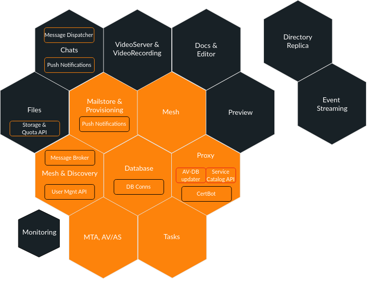

# Architecture

This section contains a description of Carbonio architecture and of the Components along with the features they provide.
Here is the architecture diagram of Carbonio:

# Fundamental Concepts

Carbonio is built on a multi-component architecture. Each component is responsible for a specific part of the collaboration suite and can be installed on a single node or distributed across multiple nodes depending on the desired level of performance, scalability, and redundancy.
  

## Core and Collaboration Components

Within the collection of components, we can distinguish:

### Core Components

These are required for the basic operation of Carbonio:

- **MTA AV/AS:** Sending and receiving emails  
- **Mailstore & Provisioning:** Account provisioning and message storage  
- **Proxy:** Web access  
- **Database / Mesh & Directory:** Backend services required for infrastructure operation  

### Collaboration Components

These add advanced collaboration and communication features to Carbonio:

- **Files**  
- **Chats**  
- **Docs & Editor**  
- **Tasks**  
- **Preview**  
- **Video Server & Video Recording**  

### Additional Components and Monitoring

Some components serve special purposes:

- **Monitoring:** Centralising metrics with dashboards tailored for Carbonio  
- **Redundancy (optional):** Needed in specific installation scenarios; includes Directory Replica and Event Streaming  
