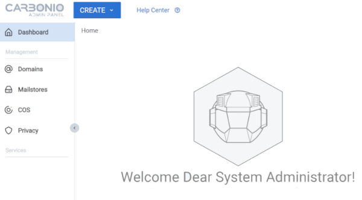

# Homepage
  

    
## Documentation Sections

The content is organized into the following sections:  
    
[Introduction](introduction.md)  
[Architecture](architecture.md)  
[Install](install.md)  
[Manage](manage.md)  
[Upgrade](upgrade.md)  
[Release Notes](release-notes.md)  
[CLI Reference](cli-reference.md)  
[API Reference](api-reference.md)  
